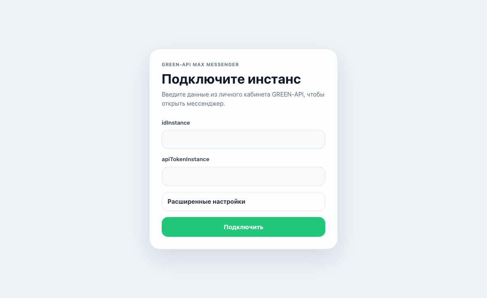
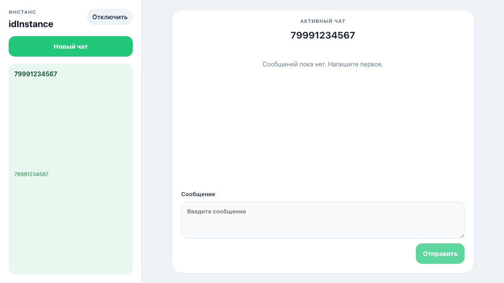
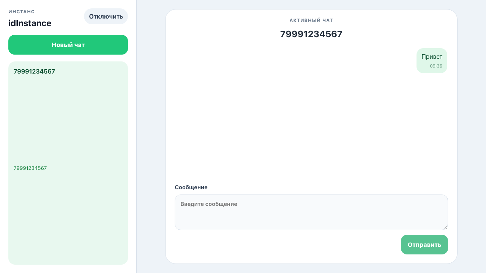
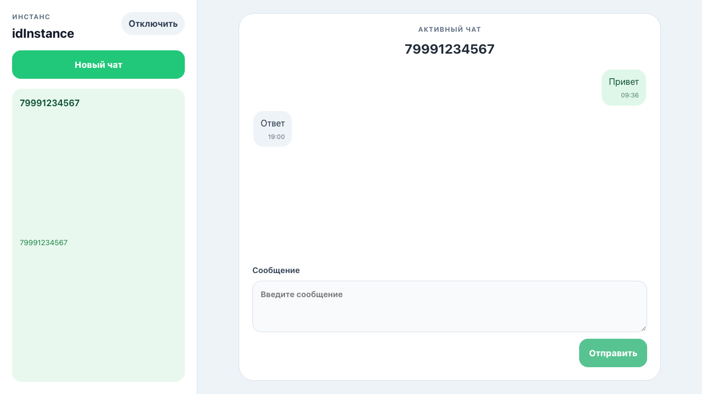

# GREEN-API MAX Messenger

Тестовое задание на позицию **Frontend-разработчик React**.

Приложение представляет собой минимальный интерфейс чата для отправки и получения **текстовых сообщений в MAX** через GREEN-API.

Интерфейс выполнен по мотивам [web.max.ru](https://web.max.ru/) и содержит только функции, необходимые по заданию.

## Что реализовано

- React-интерфейс чата
- подключение по `idInstance` и `apiTokenInstance`
- `apiUrl` из личного кабинета GREEN-API в разделе **«Расширенные настройки»**
- создание нового чата по номеру телефона через `CheckAccount`
- отправка текстовых сообщений через `SendMessage`
- получение входящих сообщений через HTTP API:
  - `ReceiveNotification`
  - `DeleteNotification`
- отображение отправленных и полученных сообщений в чате
- защита от дублирования входящих сообщений

Поддерживаются только текстовые сообщения, как требуется в тестовом задании.

## Стек

- React
- TypeScript
- Vite
- Vitest
- React Testing Library
- MSW
- Playwright

## Установка

```bash
npm install
```

## Локальный запуск

```bash
npm run dev
```

После запуска откройте адрес, который Vite выведет в терминале.

## Как проверить приложение

1. Введите `idInstance` и `apiTokenInstance` из GREEN-API.
2. Откройте **«Расширенные настройки»** и укажите `apiUrl`.
3. Нажмите **«Подключить»**.
4. Нажмите **«Новый чат»**.
5. Введите номер телефона получателя.
6. После проверки через `CheckAccount` будет создан чат.
7. Введите текст сообщения и отправьте его.
8. Получатель может ответить в MAX.
9. Входящее сообщение отображается в соответствующем чате.

## Тесты

```bash
npm run lint
npm run test
npm run test:integration
npm run test:e2e
npm run build
```

Покрыты основные сценарии тестового задания:

- подключение к GREEN-API;
- создание чата;
- отправка сообщения;
- получение ответа;
- обработка ошибок;
- duplicate notifications;
- polling lifecycle.

## Скриншоты

### Подключение



### Чат



### Исходящее сообщение



### Входящее сообщение



## GREEN-API

GREEN-API MAX:  
https://green-api.com/max

SendMessage:  
https://green-api.com/v3/docs/api/sending/SendMessage/

Получение сообщений через HTTP API:  
https://green-api.com/v3/docs/api/receiving/technology-http-api/

ReceiveNotification:  
https://green-api.com/v3/docs/api/receiving/technology-http-api/ReceiveNotification/

DeleteNotification:  
https://green-api.com/v3/docs/api/receiving/technology-http-api/DeleteNotification/
